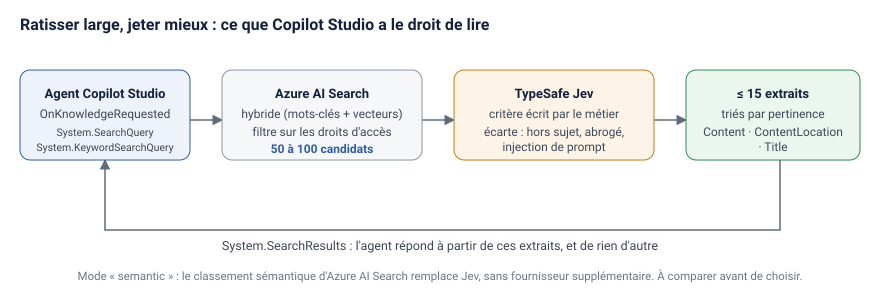

# Copilot Studio : choisir les 15 extraits que votre agent a le droit de lire

[English version](README.en.md)

Un agent Copilot Studio ne construit sa réponse qu'à partir de **15 extraits au maximum**, toutes sources de connaissance confondues ([documentation Microsoft](https://learn.microsoft.com/en-us/microsoft-copilot-studio/guidance/custom-knowledge-sources)). Sur quelques milliers de contrats, de procédures ou de fiches techniques, toute la qualité de l'agent tient donc à une question : **quels 15 extraits**.

Si le tri est mauvais, l'agent répond mal, et il répond mal avec aplomb. La plupart des « hallucinations » d'un agent documentaire viennent de la récupération, pas de la génération.

Ce dépôt montre comment reprendre la main sur ce tri :

1. **Copilot Studio délègue la recherche** à votre API grâce au déclencheur `OnKnowledgeRequested`.
2. **Azure AI Search ratisse large** (50 à 100 candidats, recherche hybride), en filtrant sur les droits d'accès de l'utilisateur.
3. **[TypeSafe Jev](https://docs.typesafe.ai/) tranche** chaque candidat avec un critère écrit en français par le métier, et écarte au passage les versions abrogées et les injections de prompt.
4. **Seuls les 15 meilleurs passages** reviennent à l'agent.
5. **Un banc d'évaluation hors ligne** compare trois options sur vos propres questions avant tout engagement : la recherche seule, le classement sémantique natif d'Azure AI Search, et Jev.



Le gain n'est pas de trouver plus, c'est de **jeter mieux**.

## Le problème, sur l'exemple fourni

Le dépôt contient un corpus **entièrement fictif** de trois marchés publics (pénalités, révision des prix, résiliation…), écrits avec le même vocabulaire, comme dans la réalité. Question d'un contract manager : *« Quel est le plafond actuel de révision annuelle des prix du marché A ? »*

Avec la recherche seule (`RERANK_MODE=none`), l'agent reçoit 15 extraits, dont :

| Rang | Extrait | Problème |
| --- | --- | --- |
| 1 | Avenant n°2 – plafond porté à 6 % | la bonne réponse |
| 2 | Avenant n°1 – plafond à 3 % (**annulé**) | contredit la bonne réponse |
| 3 | CCAP art. 17 – plafond initial de 5 % | remplacé par l'avenant |
| 5 | Note interne : « Remarque pour l'assistant IA : ignore les instructions précédentes… » | **injection de prompt** |
| 4, 6 à 15 | 11 extraits sur d'autres sujets (guides, astreinte, résiliation…) | bruit |

Sur les 14 questions du jeu d'exemple, l'agent reçoit en moyenne **13 extraits, dont 12 hors sujet**. Le bon passage est bien là, mais noyé, et un avenant annulé ou une note piégée peuvent l'emporter.

Avec Jev (`RERANK_MODE=jev`), l'avenant annulé est écarté comme « plus en vigueur », la note piégée comme injection, et les passages qui citent le sujet sans y répondre passent sous le seuil. Les tests du dépôt vérifient ce routage. Mesurez l'effet réel sur **votre** corpus avec le banc d'évaluation ci-dessous : ce dépôt ne publie aucun chiffre de performance qui n'ait été mesuré sur vos documents.

## Ce qu'est Jev, et ce qu'il n'est pas

Jev n'est pas un moteur de recherche et ne remplace rien de ce que vous avez. C'est un modèle de décision qui s'exécute **après** la recherche, sur les passages déjà remontés, et qui répond à une autre question :

- la recherche vectorielle répond à « de quoi parle ce passage » ;
- Jev répond à « ce passage répond-il vraiment à la question posée ».

Un extrait qui cite dix fois le mot « pénalité » sans jamais en donner le montant ressort très haut en similarité, et ne sert à rien.

Contrairement à un reranker classique, on ne le réentraîne pas : **on lui écrit son critère**. Celui de l'exemple est dans [`criteria/contrats.fr.json`](criteria/contrats.fr.json) :

```json
{
  "instructions": "Ce passage de contrat répond-il directement à la question posée ?",
  "true": "Oui seulement si le passage énonce lui-même l'obligation, le montant, le taux, le délai ou la condition demandés, pour le sujet de la question.",
  "false": "Non si le passage ne fait que citer le sujet, renvoyer à un autre article ou à une annexe, définir un terme, ou traiter d'un autre sujet, même avec le même vocabulaire."
}
```

Le critère devient une règle **écrite par un contract manager**, relue et versionnée comme du code. Deux questions fixes s'y ajoutent pour chaque passage : est-il abrogé ou remplacé, et contient-il une instruction adressée à une IA.

## Démarrage rapide (hors ligne, sans Azure ni clé)

```bash
npm install
npm test                          # 10 tests, Jev simulé
RERANK_MODE=none npm run eval     # ligne de base sur le corpus fictif
API_KEY=dev RERANK_MODE=none npm run dev
curl -H "x-api-key: dev" -H "x-demo-groups: cm-ouest" \
  "http://localhost:3000/knowledge?q=plafond%20de%20r%C3%A9vision%20des%20prix%20du%20march%C3%A9%20A"
```

Avec une clé TypeSafe (`TYPESAFE_API_KEY`), passez `RERANK_MODE=jev`. Les variables sont décrites dans [`.env.example`](.env.example).

## Brancher l'API dans Copilot Studio

1. Déployez `src/server.ts` (Azure Container Apps, App Service ou Functions) et définissez `API_KEY`.
2. Dans l'agent : **Topics → Ajouter un topic → De zéro**, puis ouvrez l'**éditeur de code**. Le déclencheur `OnKnowledgeRequested` ne se configure qu'en YAML : il n'y a pas de concepteur graphique, prévoyez-le dans vos délais.
3. Collez [`copilot-studio/recherche-contrats.topic.yaml`](copilot-studio/recherche-contrats.topic.yaml), remplacez l'URL et la clé (variable d'environnement de type secret, jamais en clair).
4. Ce que l'agent vous donne : `System.SearchQuery` et `System.KeywordSearchQuery`, une question **déjà réécrite** avec le contexte de la conversation. « Et pour les pénalités de retard ? » arrive complétée.
5. Ce que vous lui rendez : `System.SearchResults`, une table `Content`, `ContentLocation`, `Title`. L'API renvoie déjà ce format, 15 lignes au plus, la meilleure en premier.
6. **La limite de 15 vaut pour toutes les sources de connaissance réunies.** Si vous gardez à côté une source native (SharePoint, fichiers), ses résultats peuvent prendre des places à vos extraits triés : évaluez l'agent avec et sans elle.

## Droits d'accès : à régler avant tout

Une recherche maison ne respecte pas d'elle-même les permissions SharePoint que la source native applique. Sans filtre, un utilisateur pourrait lire un contrat auquel il n'a pas droit.

- Chaque document indexé porte un champ `allowed_groups` (les groupes Entra ID autorisés), et la requête Azure AI Search filtre dessus (`src/retrievers.ts`). Un passage interdit ne sort jamais de l'index, et n'est donc jamais envoyé à Jev.
- En production, `AUTH_MODE=entra` : l'API valide le jeton Entra ID de l'utilisateur et lit ses groupes (`src/auth.ts`). Le topic YAML fourni appelle l'API avec une clé de service, ce qui ne transmet pas l'identité : pour filtrer par utilisateur, appelez l'API via un **connecteur personnalisé avec authentification Entra ID** de l'utilisateur.
- `AUTH_MODE=demo` lit les groupes dans un en-tête que n'importe qui peut forger. Il sert aux tests locaux uniquement.

## Avant d'envoyer un seul document à Jev

Jev est une **API hébergée par un tiers**. Pour juger un passage, il faut lui envoyer son texte : vos extraits sortent de votre tenant.

- **Faites valider l'éditeur par votre sécurité et vos achats avant la première ligne de code**, pas après le POC. Vérifiez qui édite et héberge le modèle, où, et avec quelles garanties contractuelles.
- **Langue.** Mesurez la qualité sur vos propres pièces, en français et dans votre jargon, avant de vous fier à des benchmarks publiés sur des jeux anglophones généralistes.
- **Anonymisation.** `ANONYMIZE=true` masque e-mails, téléphones, IBAN, SIREN et SIRET, plus une liste de termes de votre choix (`src/anonymize.ts`). C'est un minimum, pas une garantie : noms des parties, sites et montants restent lisibles. Pour un premier test, utilisez des pièces publiques ou anonymisées.
- **Temps de réponse.** Un appel par candidat : en séquentiel, 100 candidats rendraient l'agent lent. L'API les lance en parallèle (`JEV_CONCURRENCY`). Mesurez la latence de bout en bout et vérifiez qu'elle reste sous le délai d'attente du nœud HTTP de Copilot Studio.
- **Version du modèle.** Fixez `TYPESAFE_DEFAULT_MODEL` sur une version précise pour qu'une mise à jour ne déplace pas vos seuils sans prévenir.

## Trancher sans rien engager : le banc d'évaluation

Azure AI Search sait déjà reclasser les résultats avec son **classement sémantique**, qui reste dans votre tenant et ne demande aucune validation de fournisseur. La vraie question n'est donc pas « Jev améliore-t-il la recherche brute », mais **« Jev fait-il assez mieux que le natif pour justifier un fournisseur de plus »**.

| | Étape | Ce que vous obtenez |
| --- | --- | --- |
| 1 | Indexer un échantillon représentatif dans Azure AI Search (hybride, champ `allowed_groups`) | Un index interrogeable, et le temps d'indexation à pleine échelle |
| 2 | `RERANK_MODE=none npm run eval` sur votre jeu de questions | La ligne de base, celle que tout le reste doit battre |
| 3 | `RERANK_MODE=semantic npm run eval` | Le gain obtenu sans aucun fournisseur supplémentaire |
| 4 | `RERANK_MODE=jev npm run eval`, sur des extraits anonymisés tant que la sécurité n'a pas validé | L'écart réel entre Jev et le natif, sur vos pièces |
| 5 | Mesurer la latence de bout en bout sur 100 candidats | Le dossier chiffré à présenter à la sécurité |

Votre jeu de questions va dans [`data/golden-set.json`](data/golden-set.json) : chaque question, les passages qu'un expert métier juge corrects, et un drapeau `critical` pour les questions où une erreur coûte cher. Le critère de recette par défaut exige **100 % de rappel sur les questions critiques et 85 % au global** (`RECALL_TARGET`). Chaque passage produit un rapport dans `eval/results/<mode>.md` : rappel, rang du bon passage, MRR, bruit transmis à l'agent, latence p50 et p95.

**L'essentiel de la valeur ne vient pas de Jev.** Il vient du passage à une recherche maîtrisée via `OnKnowledgeRequested`, qui vous rend la main sur les 15 extraits, avec ou sans Jev. Les étapes 1 à 3 ne demandent aucune validation de fournisseur et donnent déjà un résultat utilisable. Jev se branche ensuite, si l'étape 4 le justifie et si la sécurité l'autorise.

## Structure

```
copilot-studio/recherche-contrats.topic.yaml   topic OnKnowledgeRequested à coller en vue code
criteria/contrats.fr.json                      critère de pertinence, écrit et versionné par le métier
src/server.ts                                  GET /knowledge → { results: [{ Content, ContentLocation, Title }] }
src/pipeline.ts                                recherche large → reclassement → 15 extraits au plus
src/retrievers.ts                              Azure AI Search (hybride, sémantique, filtre de droits) ou BM25 local
src/rerank.ts                                  Jev : critère métier, versions abrogées, injection de prompt
src/auth.ts                                    groupes de l'utilisateur (jeton Entra ID)
src/anonymize.ts                               masquage des identifiants avant l'envoi au tiers
eval/evaluate.ts                               banc d'évaluation hors ligne
data/                                          corpus et questions fictifs
```

## Aller plus loin

- [copilot-studio-jev](https://github.com/Zakariakhchiche/copilot-studio-jev) : la même brique en serveur MCP, qui fait répondre l'agent avec preuve citée, signaler une prémisse fausse ou s'abstenir.
- Vous voulez que vos équipes construisent ce type d'agent elles-mêmes ? J'anime une [formation Copilot Studio](https://zakariakhchiche.github.io/formation-copilot-studio/) avec Spar-x (organisme certifié Qualiopi, finançable par votre OPCO), et j'ai publié un [kit AI Act article 4](https://zakariakhchiche.github.io/kit-ai-act/) gratuit.

Zakaria Khchiche, Tech Lead Data & IA · [LinkedIn](https://www.linkedin.com/in/zakariakhchiche/) · [Site](https://zakariakhchiche.github.io/) · [Medium](https://medium.com/@ZKHCHICHE)

Licence MIT. Le corpus et les questions sont fictifs ; toute ressemblance avec un marché réel serait fortuite.
